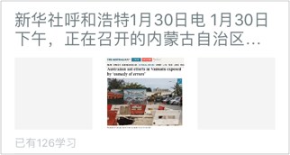
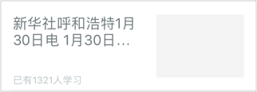
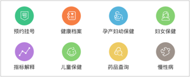
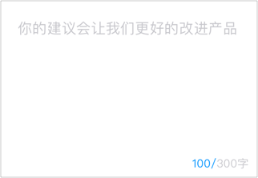
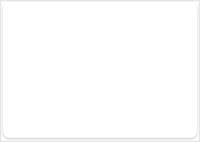

## 移动端UI组件

[TOC]

#### 列表样式

##### CDM_Cell_title_subIcon_ani

- 标题展开(收缩)item_cell

  ##### 

  ##### 

##### CDM_Cell_icon_main_sub_title

- 图标、主标题、子标题 item_cell 

  ##### 

##### CDM_Cell_icon_title_arrow

- 图标、标题 item_cell 

  ##### 

##### CDM_Cell_icon_title_btn

- 小图标、标题、副按钮 item_cell 

  ##### 

##### CDM_Cell_title_edit

- 标题 输入 item_cell 

  ##### 

##### CDM_Cell_title_select

- 选择 item_cell 

  ##### 

##### CDM_Cell_icon_title_subtitle_arrow

- 图标 标题 副标题带小箭头 

  ##### 

##### CDM_Cell_news_more

- 新闻 多张图片 item_cell 

  ##### 

##### CDM_Cell_news_one

- 新闻 一张张图片 item_cell 

  ##### 

##### CDM_Cell_title_img

- 头像item_cell 

  ##### 

#### 按钮

##### CDM_Gradient_btn

- 居中操作按钮 

  ##### 

  ##### 

#### View

##### CDM_Upload_view

- 上传图片 

  ##### 

##### CDM_Grid

- 宫格视图  

  ##### 

##### CDM_Tag_view

- 不定长度的按钮视图

  ##### 

##### CDM_Limit_textview

- 带字数提示的文本输入 

  ##### 

##### CDM_Shadow_view

- 阴影背景 

  ##### 

##### CDM_Scroll_menu

- 滚动菜单 

  ##### 

##### CDM_Search_bar

- 搜索框 

  ##### 

#### 输入框

##### CDM_Icon_input

- 带左(右)图标的输入框

    ##### 
